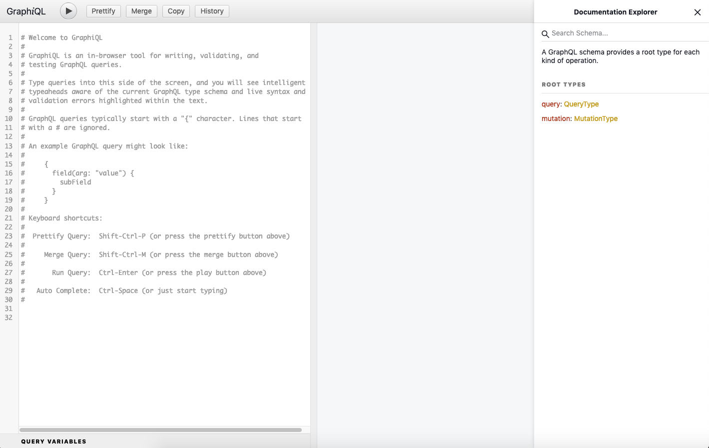
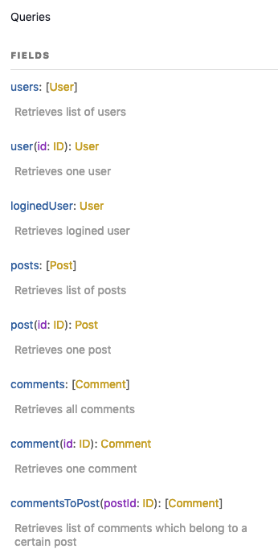
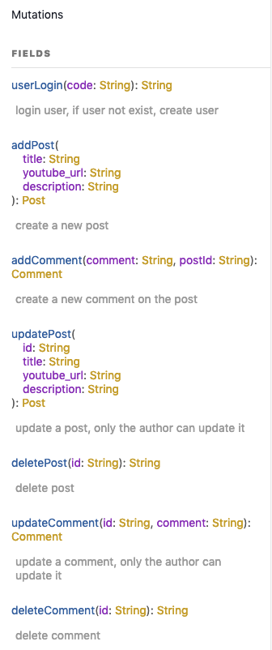

# GraphQL API endpoint for a React web app

> This is a practice project to apply the combinations of GraphQL, MongoDB and DataLoader.

## Table of Contents

- [General Info](#general-information)
- [Technologies Used](#technologies-used)
- [Features](#features)
- [Screenshots](#screenshots)
- [Setup](#setup)
- [How to use](#how-to-use)

## General Information

- This project is to create a GraphQL API endpoint for a react web app. The react web app will send requests through Apollo Client. The GraphQL API will fetch data depends on the requests from a MongoDB database deployed on MongoDB Altas cloud.
- This project used Node.js, Express.js, MongoDB, GraphQL, DataLoader and JWT authentication.
- GraphQL provides many benefits over REST APIs. It allows users to dictate the exact data they need from the server. It avoids let users send multiple API requests or have to receive a complete set of data that contains unnecessary information. The DataLoader solves the N+1 problem of GraphQL APIs.

## Technologies Used

- Node version: 16.1.0
- Express version: 4.17.1
- GraphQL: 15.5.1
- Mongoose: 5.13.5
- DataLoader: 2.0.0
- JSON Web Token: 8.5.1

## Features

- GraphQL API endpoint to fetch data from MongoDB database
- JWT authentication
- GraphiQL interface to test API queris and mutations

## Screenshots

- GraphiQL interface:
  

## Setup

To run this project, install it locally using npm

```bash
$ npm install
$ npm start
```

You need to provide your own .env file which should includes:

- PORT =a port number
- MONGO_URI =the URI to link with MongoDB
  if you also want to use the Github OAuth feature, you need provide these information as well:
- JWT_SECRET =your own jwt secret
- GITHUB_APP_ID=your own GITHUB_APP_ID
- GITHUB_CLIENT_ID=your own GITHUB_CLIENT_ID
- GITHUB_CLIENT_SECRET=your own GITHUB_CLIENT_SECRET

You can use GraphiQL interface by this address:
http://localhost:port/graphql


## How to use

The mutations and queries are shown below.

- Queries:
  

- Mutations:
  

You can use the queries to fetch data from the database. However, the mutations are required further authentication. Otherwise, an authentication warning will be shown.

